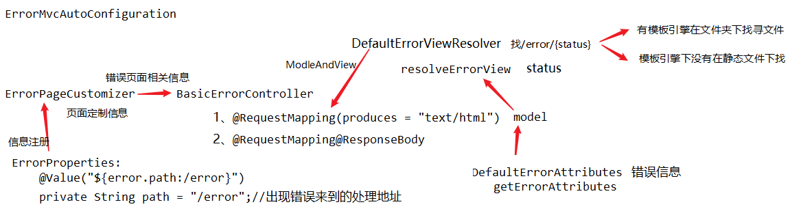

# master 

## 标签

以下栗子都是来自尚硅谷springboot教学视频

* v0.1 frist springboot
* v0.2.1 springboot config bean
* v0.2.2 springboot config file load
* v0.3 springboot logging
* v0.4 springboot thymeleaf and config
* v0.5 springboot crud
* v0.6 springboot web custom error page

* v0.7 springboot dabase mybatis使用

# 知识点

## 一、SpringBoot 异常处理

### 1、粗略流程(V 1.5.9)


①程序发生错误，请求`BasicErrorController`。

②如果是浏览器，根据`ErrorPageCustomizer`注册的信息和需要的默认信息`DefaultErrorAttributes`准备生成视图。

③`DefaultErrorViewResolver`找不到⑴模板引擎目录下的视图，则去⑵静态资源中找寻，静态资源中没有则选择⑶springboot的空白页面。

④如果是其他客户端则返回`JSON`数据。

### 2、源码
```java
public class ErrorMvcAutoConfiguration {
	@Bean
	@ConditionalOnMissingBean(value = ErrorAttributes.class, search = SearchStrategy.CURRENT)
	public DefaultErrorAttributes errorAttributes() {
		return new DefaultErrorAttributes();
	}
    @Bean
	@ConditionalOnMissingBean(value = ErrorController.class, search = SearchStrategy.CURRENT)
	public BasicErrorController basicErrorController(ErrorAttributes errorAttributes) {
		return new BasicErrorController(errorAttributes, this.serverProperties.getError(),
				this.errorViewResolvers);
	}
    @Bean
	public ErrorPageCustomizer errorPageCustomizer() {
		return new ErrorPageCustomizer(this.serverProperties);
	}
    //去哪个页面由DefaultErrorViewResolver决定
    @Configuration
	static class DefaultErrorViewResolverConfiguration {
    	...
        @Bean
		@ConditionalOnBean(DispatcherServlet.class)
		@ConditionalOnMissingBean
		public DefaultErrorViewResolver conventionErrorViewResolver() {
			return new DefaultErrorViewResolver(this.applicationContext,
					this.resourceProperties);
		}
    }
    //错误页面模型
    protected Map<String, Object> getErrorAttributes(HttpServletRequest request,
			boolean includeStackTrace) {
		RequestAttributes requestAttributes = new ServletRequestAttributes(request);
		return this.errorAttributes.getErrorAttributes(requestAttributes,
				includeStackTrace);
	}
    
    private static class ErrorPageCustomizer implements ErrorPageRegistrar, Ordered {

		private final ServerProperties properties;

		protected ErrorPageCustomizer(ServerProperties properties) {
			this.properties = properties;
		}

		@Override
		public void registerErrorPages(ErrorPageRegistry errorPageRegistry) {
			ErrorPage errorPage = new ErrorPage(this.properties.getServletPrefix()
					+ this.properties.getError().getPath());
            /*
            	ErrorProperties:
            		@Value("${error.path:/error}")
					private String path = "/error";//出现错误来到的处理地址
            */
			errorPageRegistry.addErrorPages(errorPage);
		}

		@Override
		public int getOrder() {
			return 0;
		}

	}
}
```
```java
@Controller
@RequestMapping("${server.error.path:${error.path:/error}}")
public class BasicErrorController extends AbstractErrorController {
    @RequestMapping(produces = "text/html")
	public ModelAndView errorHtml(HttpServletRequest request,
			HttpServletResponse response) {
        HttpStatus status = getStatus(request);
		Map<String, Object> model = Collections.unmodifiableMap(getErrorAttributes(
				request, isIncludeStackTrace(request, MediaType.TEXT_HTML)));
		response.setStatus(status.value());
        //去哪个页面，resolveErrorView查找ErrorViewResolver。
		ModelAndView modelAndView = resolveErrorVie w(request, response, status, model);
		return (modelAndView == null ? new ModelAndView("error", model) : modelAndView);
    }
    @RequestMapping
	@ResponseBody
	public ResponseEntity<Map<String, Object>> error(HttpServletRequest request) {
        
    }
}
public abstract class AbstractErrorController implements ErrorController {
    protected ModelAndView resolveErrorView(HttpServletRequest request,
			HttpServletResponse response, HttpStatus status, Map<String, Object> model) {
		for (ErrorViewResolver resolver : this.errorViewResolvers) {
			ModelAndView modelAndView = resolver.resolveErrorView(request, status, model);
			if (modelAndView != null) {
				return modelAndView;
			}
		}
		return null;
	}
}
```
```java
public class DefaultErrorViewResolver implements ErrorViewResolver, Ordered {
    @Override
	public ModelAndView resolveErrorView(HttpServletRequest request, HttpStatus status,
			Map<String, Object> model) {
		ModelAndView modelAndView = resolve(String.valueOf(status), model);
		if (modelAndView == null && SERIES_VIEWS.containsKey(status.series())) {
			modelAndView = resolve(SERIES_VIEWS.get(status.series()), model);
		}
		return modelAndView;
	}
	private ModelAndView resolve(String viewName, Map<String, Object> model) {
        //默认找error/{status}
		String errorViewName = "error/" + viewName;
        //模板引擎可用的情况下
		TemplateAvailabilityProvider provider = this.templateAvailabilityProviders
				.getProvider(errorViewName, this.applicationContext);
		if (provider != null) {
			return new ModelAndView(errorViewName, model);
		}
        //不可用的情况下，静态文件加下找html
		return resolveResource(errorViewName, model);
	}
    private ModelAndView resolveResource(String viewName, Map<String, Object> model) {
		for (String location : this.resourceProperties.getStaticLocations()) {
			try {
				Resource resource = this.applicationContext.getResource(location);
				resource = resource.createRelative(viewName + ".html");
				if (resource.exists()) {
					return new ModelAndView(new HtmlResourceView(resource), model);
				}
			}
			catch (Exception ex) {
			}
		}
		return null;
	}
}
```
```java
//错误页面模型数据
public class DefaultErrorAttributes
		implements ErrorAttributes, HandlerExceptionResolver, Ordered {
    @Override
	public Map<String, Object> getErrorAttributes(RequestAttributes requestAttributes,
			boolean includeStackTrace) {
		Map<String, Object> errorAttributes = new LinkedHashMap<String, Object>();
		errorAttributes.put("timestamp", new Date());
		addStatus(errorAttributes, requestAttributes);
		addErrorDetails(errorAttributes, requestAttributes, includeStackTrace);
		addPath(errorAttributes, requestAttributes);
		return errorAttributes;
	}
    /*错误模型默认成员	
    	path
    	trace
    	message
    	errors
    	exception
    	status
    	timestamp
    */
}
```

### 3、定制错误信息模型

1、通过定义异常，返回原有数据值(错误信息模型还是相同的成员)。

2、通过异常捕获放回json数据，达到返回定制成员(无法自适应效果)。

3、异常捕获，转发到`/error`无法将定制成员携带出去。

4、自定义一个`ErrorControl`可以自定义异常处理。(初学不推荐)

5、自定义一个`DefaultErrorAttributes`，`getErrorAttributes`方法中添加定制成员。